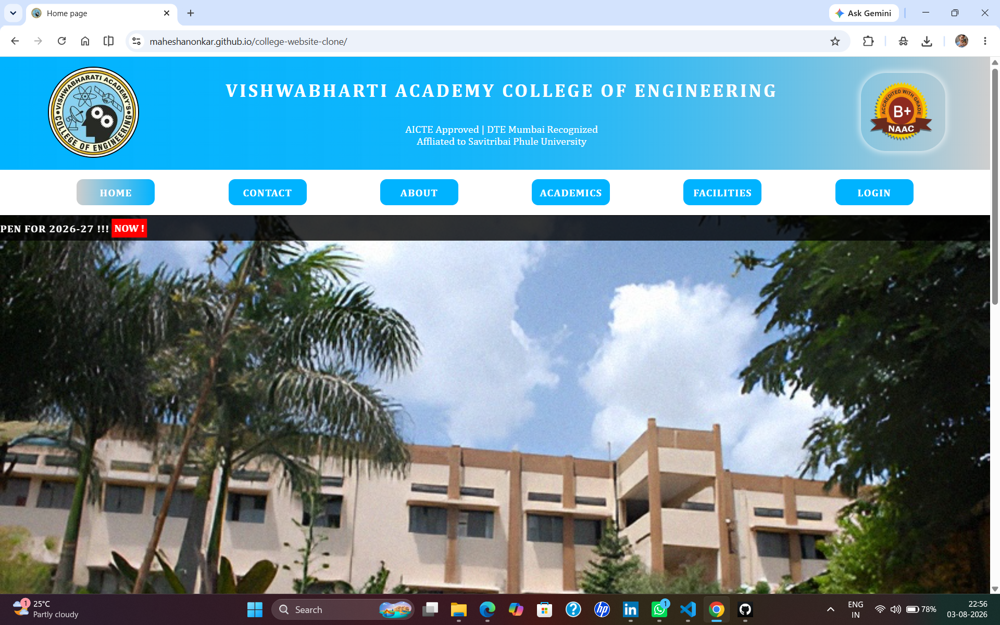
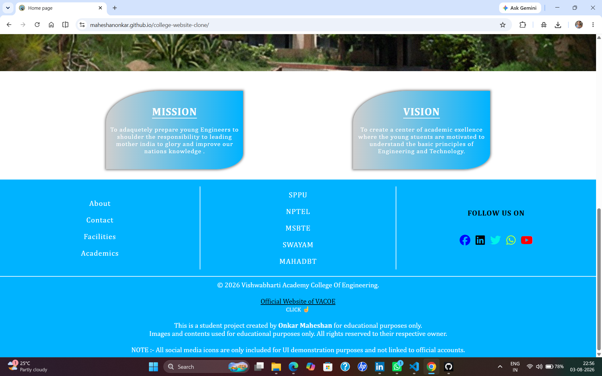
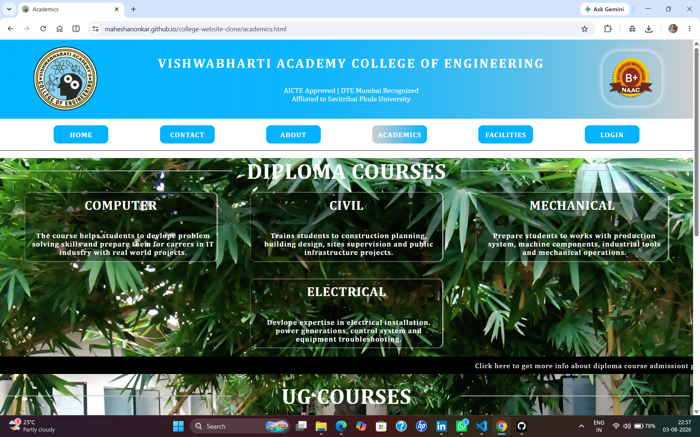
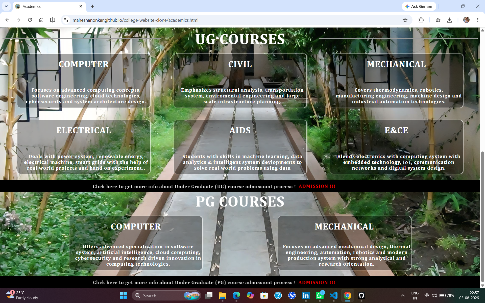
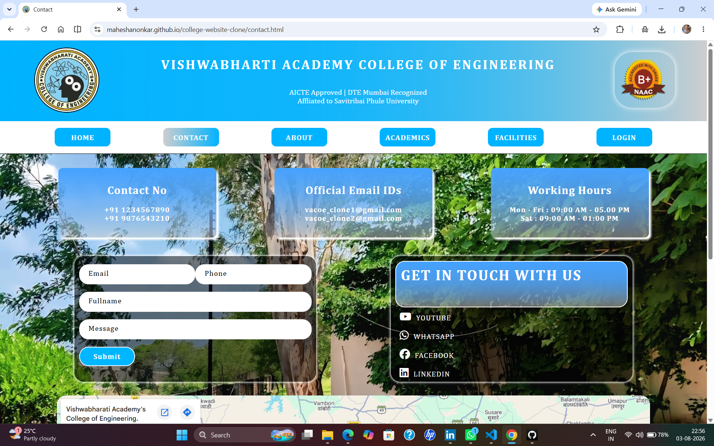
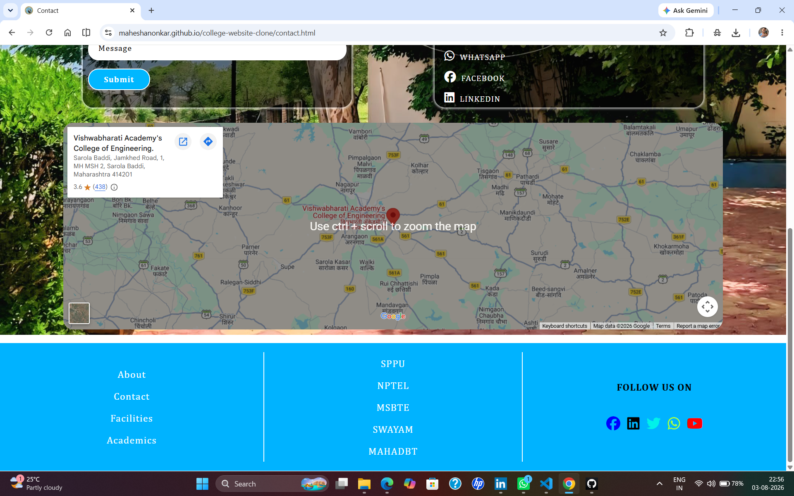
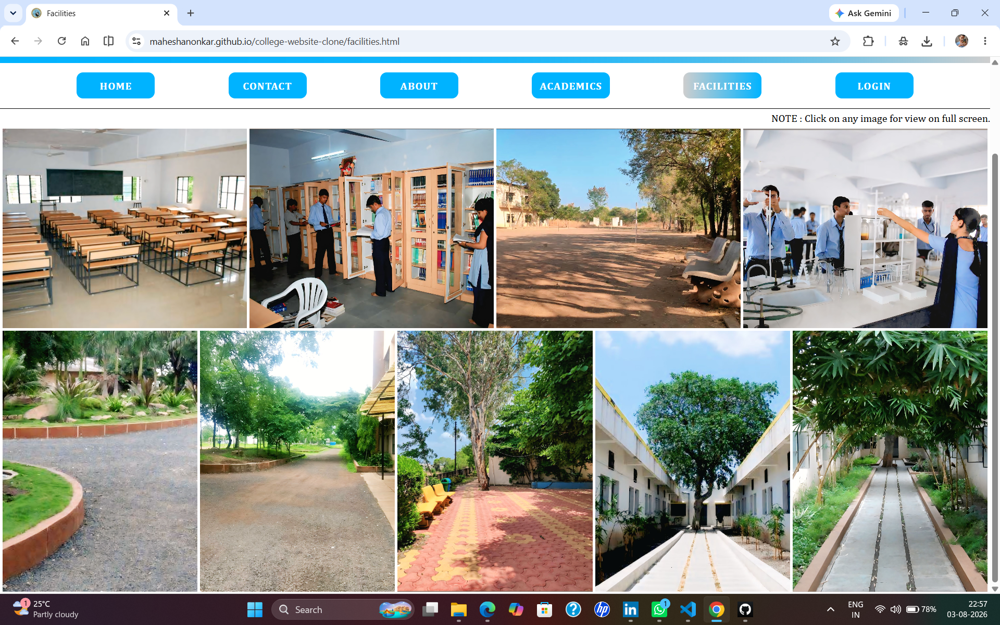
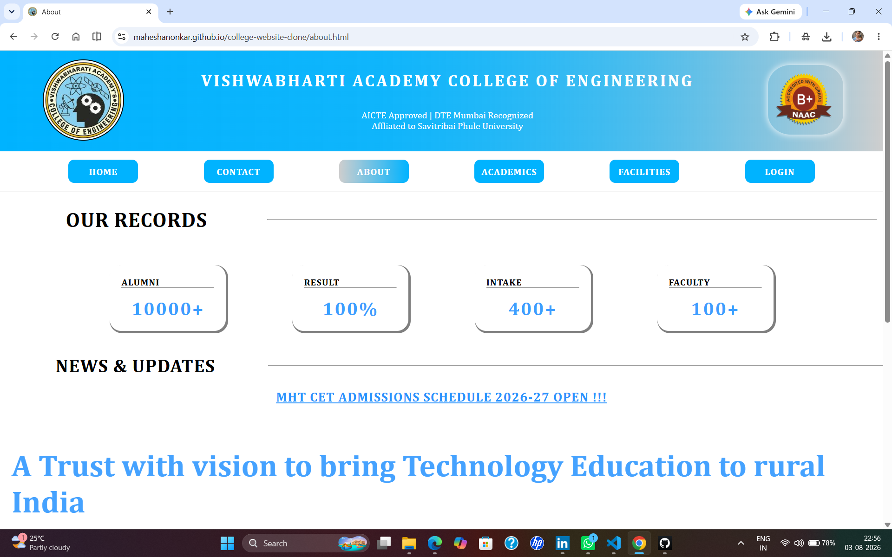
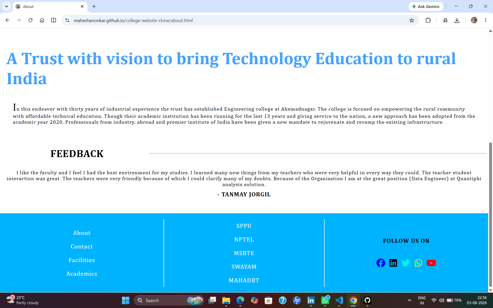

# 🎓 Vishwabharti Academy College of Engineering - Website Clone

A responsive multi-page college website clone built using **HTML5**, **CSS3**, and **JavaScript**. This project was created to strengthen my frontend development fundamentals and improve my understanding of responsive layouts, DOM manipulation, and interactive web design.

## 🌐 Live Demo

🔗 https://maheshanonkar.github.io/college-website-clone/

## 📂 GitHub Repository

🔗 https://github.com/maheshanonkar/college-website-clone

## 🚀 Features

- 🏫 Multi-page college website
- 📱 Responsive design
- 🎨 Modern UI
- 🔄 Smooth hover effects & transitions
- 🔢 Animated statistics counters
- 🖼️ Image/Feedback slider
- 📰 News & Updates section
- 📞 Contact page
- 🎓 Academics page
- 🏢 Facilities page
- 🔐 Student Login page
- 🖱️ Interactive JavaScript components
- ⚡ Clean and simple navigation

## 🛠️ Technologies Used

- HTML5
- CSS3
- JavaScript (ES6)
- Git
- GitHub

## 📁 Project Structure

```
COLLEGE_CLONE_HTML-CSS
│
├── index.html
├── about.html
├── academics.html
├── facilities.html
├── contact.html
├── login.html
│
├── assets
│   ├── css
│   ├── js
│   ├── images
│   └── icons
    └── screenshots
│
└── README.md
```

## 🎯 Learning Outcomes

This project helped me practice and improve:

- Semantic HTML
- CSS Flexbox & Grid
- Responsive Web Design
- DOM Manipulation
- Event Handling
- JavaScript Animations
- Interactive UI Components
- Project Organization
- Git & GitHub Workflow

## 📸 Screenshots

1. Home Page 

    <p align="center">
        
        
    </p>

2. Academics Page

    <p align="center">
        
        
    </p>

3. Contact Page

    <p align="center">
        
        
    </p>

4. Facilities Page

    <p align="center">
        
    </p>

5. About Page

    <p align="center">
        
        
    </p>

## 🔮 Future Improvements

- 🔍 Search functionality
- 📅 Events Calendar
- 💾 Backend Integration
- 📊 Student Dashboard
- 🔑 Authentication System
- 📱 More Responsive Enhancements
- ⚡ Performance Optimization

## 🤝 Feedback

Suggestions and feedback are always welcome. Feel free to open an issue or submit a pull request.

## 👨‍💻 Author

Name : **Onkar Maheshan**
Branch : Computer Engineering

- **GitHub :** https://github.com/maheshanonkar
- **LinkedIn :** https://www.linkedin.com/in/onkar-maheshan-670b6834b/

--------------------------------------------------------

⭐ If you like this project, consider giving it a **Star** on GitHub!
